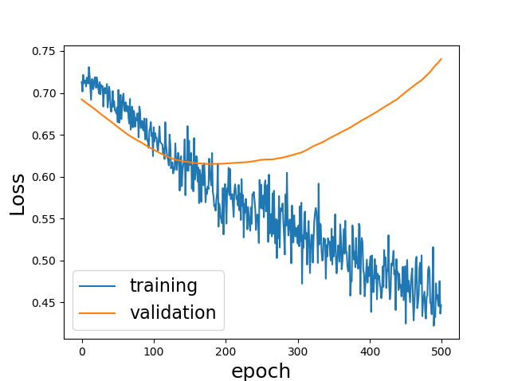

# lung_TCGA_prediction
## Installation 
pandas, numpy, matplotlib, scikit-learn, pytorch 1.1.0
## Data
TCGA lung datasets: TCGA-LUAD, TCGA-LUSC

Select patients who received external beam radiotherapy at primary tumor field as adjuvant therapy.

Select those have both dose and endpoint (local control) information.

In total: 45 patients
## Model 
Adopt a fully-connected 2-hidden layer neural network (NN) to predict local control probability. 
## Result
Plotting history of training/test losses 

Calculating area under receiver operating curve (AUC)

